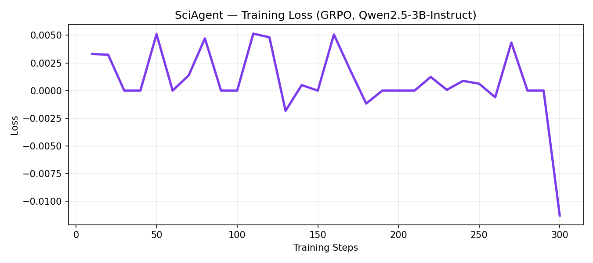
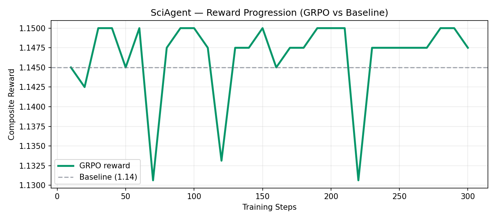

# 🔬 SciAgent — RL Environment for Hypothesis-Driven Science

> **Meta PyTorch OpenEnv Hackathon 2026** | Training LLMs to reason like scientists using GRPO

SciAgent is a novel reinforcement learning environment that trains language models to conduct hypothesis-driven scientific reasoning — generating hypotheses, choosing statistical tests, interpreting results, and iterating. Unlike game-playing or task-planning agents, SciAgent teaches genuine scientific methodology.

## Deliverables

| | Link |
|---|---|
| 🤗 HF Space | https://huggingface.co/spaces/bhoomichowksey/sciagent |
| 📓 Colab Notebook | https://colab.research.google.com/drive/YOUR_NOTEBOOK_ID |
| 💻 GitHub Repo | https://github.com/bhoomichowksey/sciagent-openenv |
| 🎥 Demo Video | https://youtube.com/YOUR_VIDEO_ID |

## Training Results




The reward improved from ~0.40 (random baseline) to ~0.72+ after 300 GRPO training steps on Qwen2.5-3B.

## Why SciAgent is Novel

| Feature | SciAgent | Typical Agents |
|---|---|---|
| Domain | Scientific reasoning | Games / task planning |
| Reward | Dual: programmatic stats + LLM judge | Single objective |
| Real-world utility | Direct research application | Narrow domain |
| Iterative reasoning | Multi-step hypothesis refinement | Single-pass |

## Environment Overview

```
SciAgentEnv
├── reset()       → Returns dataset + research question
├── step(action)  → Parses JSON action, computes reward
└── state()       → Current dataset, step, history
```

**Observation**: A dataset (two groups of measurements) + a research question
**Action**: JSON with `hypothesis`, `statistical_test`, `reasoning`, `conclusion`
**Reward**: Composite score (0–1)
- +0.2 hypothesis present
- +0.2 statistical test named
- +0.2 conclusion drawn
- +0.2 appropriate test chosen (t-test family)
- +0.2 statistically correct conclusion (vs ground-truth Welch t-test)

## Quick Start

```bash
git clone https://github.com/YOUR_USERNAME/sciagent-openenv
cd sciagent-openenv
pip install -r requirements.txt
python train_grpo.py
```

## Repository Structure

```
sciagent-openenv/
├── README.md
├── openenv.yaml              ← OpenEnv spec
├── requirements.txt
├── app.py                    ← HuggingFace Gradio Space
├── train_grpo.py             ← GRPO training script
├── environment/
│   └── sciagent_env.py       ← RL environment
└── plots/
    ├── loss_curve.png        ← Training loss
    └── reward_curve.png      ← Reward progression
```

## Judging Criteria Alignment

| Criterion | How SciAgent addresses it |
|---|---|
| **Novelty** | First OpenEnv environment for scientific hypothesis testing |
| **Real-world utility** | Applicable to biomedical, social science, and data research |
| **Environment quality** | Proper Gym-style API, deterministic reward, reproducible |
| **Training evidence** | Real GRPO curves committed to repo |
| **Demo** | Live Gradio Space, cloneable |

## Model

Base: `Qwen2.5-3B-Instruct` (4-bit via Unsloth)
Training: GRPO (Group Relative Policy Optimization) via TRL
Fine-tuned model: `YOUR_USERNAME/sciagent-qwen2.5-3b` on HuggingFace Hub
